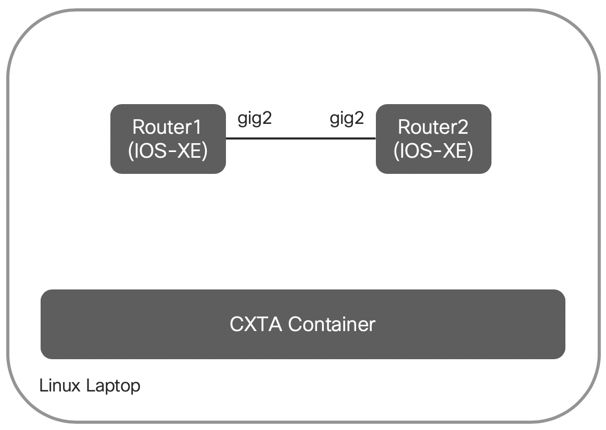

# Bringing up the Topology

## Overview

We have created a setup on this laptop you are sitting in front of which consists of 

- a CXTA docker container containing the Python runtime environment to execute the tests
- two virtual IOS-XE devices which serve as units-under-test (UUT)

The setup is depicted in the below diagram.



## Start the Environment

To start the environment, please execute the following commands from your Linux shell:

```
cd xxx/DEVWKS-1407
./start-routers.sh
```

This shell script performs the following tasks:

- It uses Vagrant to bring up the two IOS-XE virtual routers (using Virtualbox)
- Performs an initial configuration of the devices (essentially setting the hostname and configures IPv4/IPv6 on the link between the devices)
- Creates a testbed.yaml file which contains the device credentials and SSH ports to connect to the two virtual devices
- Starts the CXTA container (using docker-compose)

As a final step, a Robot/CXTA test is run which verifies the basic connectivity.  
If all went well, the script output should end with below:

```
==============================================================================
Test-Vms
==============================================================================
connect to all devices                                                | PASS |
Connected to ['r1', 'r2']
------------------------------------------------------------------------------
Test-Vms                                                              | PASS |
1 critical test, 1 passed, 0 failed
1 test total, 1 passed, 0 failed
==============================================================================
```

If the test shows an error, it typically points to an issue bringing up the VM. Please refer to the next paragraph for some troubleshooting guidance.

Please check for a full output of a working startup at [the end of this page](#appendix-sample-startup-output).

Please move on to the [next chapter](01-basic.md) to create and execute your first test case.

## Troubleshooting the Start

You should first check if both VMs are up and running using the `vagrant status` command. You should see two VMs running:

```
$ vagrant status
Current machine states:

r1                        running (virtualbox)
r2                        running (virtualbox)
```

 If this is not the case, please try to re-execute the `./start-routers.sh` script from above. If this still fails, please kill the VMs before trying again:

```
$ vagrant destroy -f

[...]

$ ./start-routers.sh
```


If both VMs show up as _running_, you should be able to ssh into them, using the `vagrant ssh xx` command (replacing xx by the router name, i.e. r1 or r2):

```
[devnet@oli-test-w CLEUR20-CXTA]$ vagrant ssh r1


r1#
```

You can then verify the connectivity between the two routers via the direct connection, for example by checking the routing adjacency (using `show ip ospf neighbor`), you should see one neighbour:

```
r1#show ip ospf neighbor

Neighbor ID     Pri   State           Dead Time   Address         Interface
10.0.0.2          1   FULL/BDR        00:00:38    172.16.0.2      GigabitEthernet2
r1#
```

Use `exit` to exit from the device(s).

## Appendix: Sample Startup Output

```
$ ./start-routers.sh
Bringing machine 'r1' up with 'virtualbox' provider...
==> r1: Clearing any previously set forwarded ports...
==> r1: Clearing any previously set network interfaces...
==> r1: Preparing network interfaces based on configuration...
    r1: Adapter 1: nat
    r1: Adapter 2: intnet
    r1: Adapter 3: intnet
==> r1: Forwarding ports...
    r1: 830 (guest) => 2223 (host) (adapter 1)
    r1: 80 (guest) => 2224 (host) (adapter 1)
    r1: 443 (guest) => 2225 (host) (adapter 1)
    r1: 8443 (guest) => 2226 (host) (adapter 1)
    r1: 22 (guest) => 2222 (host) (adapter 1)
==> r1: Running 'pre-boot' VM customizations...
==> r1: Booting VM...
==> r1: Waiting for machine to boot. This may take a few minutes...
    r1: SSH address: 127.0.0.1:2222
    r1: SSH username: vagrant
    r1: SSH auth method: private key
==> r1: Machine booted and ready!
==> r1: Checking for guest additions in VM...
    r1: No guest additions were detected on the base box for this VM! Guest
    r1: additions are required for forwarded ports, shared folders, host only
    r1: networking, and more. If SSH fails on this machine, please install
    r1: the guest additions and repackage the box to continue.
    r1:
    r1: This is not an error message; everything may continue to work properly,
    r1: in which case you may ignore this message.
==> r1: Machine already provisioned. Run `vagrant provision` or use the `--provision`
==> r1: flag to force provisioning. Provisioners marked to run always will still run.

==> r1: Machine 'r1' has a post `vagrant up` message. This is a message
==> r1: from the creator of the Vagrantfile, and not from Vagrant itself:
==> r1:
==> r1:
==> r1:     Welcome to the IOS XE VirtualBox.
==> r1:     To connect to the XE via ssh, use: 'vagrant ssh'.
==> r1:     To ssh to XE's NETCONF or RESTCONF agent, use:
==> r1:     'vagrant port' (vagrant version > 1.8)
==> r1:     to determine the port that maps to the guestport,
==> r1:
==> r1:     The password for the vagrant user is vagrant
==> r1:
==> r1:     IMPORTANT:  READ CAREFULLY
==> r1:     The Software is subject to and governed by the terms and conditions
==> r1:     of the End User License Agreement and the Supplemental End User
==> r1:     License Agreement accompanying the product, made available at the
==> r1:     time of your order, or posted on the Cisco website at
==> r1:     www.cisco.com/go/terms (collectively, the 'Agreement').
==> r1:     As set forth more fully in the Agreement, use of the Software is
==> r1:     strictly limited to internal use in a non-production environment
==> r1:     solely for demonstration and evaluation purposes. Downloading,
==> r1:     installing, or using the Software constitutes acceptance of the
==> r1:     Agreement, and you are binding yourself and the business entity
==> r1:     that you represent to the Agreement. If you do not agree to all
==> r1:     of the terms of the Agreement, then Cisco is unwilling to license
==> r1:     the Software to you and (a) you may not download, install or use the
==> r1:     Software, and (b) you may return the Software as more fully set forth
==> r1:     in the Agreement.
Bringing machine 'r2' up with 'virtualbox' provider...
==> r2: Clearing any previously set forwarded ports...
==> r2: Fixed port collision for 830 => 2223. Now on port 2200.
==> r2: Fixed port collision for 80 => 2224. Now on port 2201.
==> r2: Fixed port collision for 443 => 2225. Now on port 2202.
==> r2: Fixed port collision for 8443 => 2226. Now on port 2203.
==> r2: Fixed port collision for 22 => 2222. Now on port 2204.
==> r2: Clearing any previously set network interfaces...
==> r2: Preparing network interfaces based on configuration...
    r2: Adapter 1: nat
    r2: Adapter 2: intnet
    r2: Adapter 3: intnet
==> r2: Forwarding ports...
    r2: 830 (guest) => 2200 (host) (adapter 1)
    r2: 80 (guest) => 2201 (host) (adapter 1)
    r2: 443 (guest) => 2202 (host) (adapter 1)
    r2: 8443 (guest) => 2203 (host) (adapter 1)
    r2: 22 (guest) => 2204 (host) (adapter 1)
==> r2: Running 'pre-boot' VM customizations...
==> r2: Booting VM...
==> r2: Waiting for machine to boot. This may take a few minutes...
    r2: SSH address: 127.0.0.1:2204
    r2: SSH username: vagrant
    r2: SSH auth method: private key
==> r2: Machine booted and ready!
==> r2: Checking for guest additions in VM...
    r2: No guest additions were detected on the base box for this VM! Guest
    r2: additions are required for forwarded ports, shared folders, host only
    r2: networking, and more. If SSH fails on this machine, please install
    r2: the guest additions and repackage the box to continue.
    r2:
    r2: This is not an error message; everything may continue to work properly,
    r2: in which case you may ignore this message.
==> r2: Machine already provisioned. Run `vagrant provision` or use the `--provision`
==> r2: flag to force provisioning. Provisioners marked to run always will still run.

==> r2: Machine 'r2' has a post `vagrant up` message. This is a message
==> r2: from the creator of the Vagrantfile, and not from Vagrant itself:
==> r2:
==> r2:
==> r2:     Welcome to the IOS XE VirtualBox.
==> r2:     To connect to the XE via ssh, use: 'vagrant ssh'.
==> r2:     To ssh to XE's NETCONF or RESTCONF agent, use:
==> r2:     'vagrant port' (vagrant version > 1.8)
==> r2:     to determine the port that maps to the guestport,
==> r2:
==> r2:     The password for the vagrant user is vagrant
==> r2:
==> r2:     IMPORTANT:  READ CAREFULLY
==> r2:     The Software is subject to and governed by the terms and conditions
==> r2:     of the End User License Agreement and the Supplemental End User
==> r2:     License Agreement accompanying the product, made available at the
==> r2:     time of your order, or posted on the Cisco website at
==> r2:     www.cisco.com/go/terms (collectively, the 'Agreement').
==> r2:     As set forth more fully in the Agreement, use of the Software is
==> r2:     strictly limited to internal use in a non-production environment
==> r2:     solely for demonstration and evaluation purposes. Downloading,
==> r2:     installing, or using the Software constitutes acceptance of the
==> r2:     Agreement, and you are binding yourself and the business entity
==> r2:     that you represent to the Agreement. If you do not agree to all
==> r2:     of the terms of the Agreement, then Cisco is unwilling to license
==> r2:     the Software to you and (a) you may not download, install or use the
==> r2:     Software, and (b) you may return the Software as more fully set forth
==> r2:     in the Agreement.
Setting up r1


r1#conf term
Enter configuration commands, one per line.  End with CNTL/Z.
r1(config)#hostname r1
r1(config)#ipv6 unicast-routing
r1(config)#no ip domain-lookup
r1(config)#default interface Loopback0
Interface Loopback0 set to default configuration
r1(config)#interface loopback0
r1(config-if)# ip address 10.0.0.1 255.255.255.255
r1(config-if)# ipv6 address fd00:0:0:0::1/128
r1(config-if)# ip ospf 1 area 0
r1(config-if)# ipv6 ospf 1 area 0
r1(config-if)#default interface GigabitEthernet2
Interface GigabitEthernet2 set to default configuration
r1(config)#interface GigabitEthernet2
r1(config-if)# no shut
r1(config-if)# ip address 172.16.0.1 255.255.255.0
r1(config-if)# ipv6 address fd00:a:a:a:2::1/64
r1(config-if)# ip ospf 1 area 0
r1(config-if)# ipv6 ospf 1 area 0
r1(config-if)#end
r1#write
Building configuration...
[OK]
r1#exit
Connection to 127.0.0.1 closed by remote host.
Setting up r2


r2#conf term
Enter configuration commands, one per line.  End with CNTL/Z.
r2(config)#hostname r2
r2(config)#ipv6 unicast-routing
r2(config)#no ip domain-lookup
r2(config)#default interface Loopback0
Interface Loopback0 set to default configuration
r2(config)#interface loopback0
r2(config-if)# ip address 10.0.0.2 255.255.255.255
r2(config-if)# ipv6 address fd00:0:0:0::2/128
r2(config-if)# ip ospf 1 area 0
r2(config-if)# ipv6 ospf 1 area 0
r2(config-if)#default interface GigabitEthernet2
Interface GigabitEthernet2 set to default configuration
r2(config)#interface GigabitEthernet2
r2(config-if)# no shut
r2(config-if)# ip address 172.16.0.2 255.255.255.0
r2(config-if)# ipv6 address fd00:a:a:a:2::2/64
r2(config-if)# ip ospf 1 area 0
r2(config-if)# ipv6 ospf 1 area 0
r2(config-if)#end
r2#write
Building configuration...
[OK]
r2#exit
Connection to 127.0.0.1 closed by remote host.
Setting up testbed.yaml
r1, 127.0.0.1:2222, IdentityFile /home/devnet/.vagrant.d/insecure_private_key
r2, 127.0.0.1:2204, IdentityFile /home/devnet/.vagrant.d/insecure_private_key
starting cxta container
Starting cxta_devnet ... done
Starting cxta_docs   ... done
==============================================================================
Test-Vms
==============================================================================
connect to all devices                                                | PASS |
Connected to ['r1', 'r2']
------------------------------------------------------------------------------
Test-Vms                                                              | PASS |
1 critical test, 1 passed, 0 failed
1 test total, 1 passed, 0 failed
==============================================================================
Output:  /tmp/output.xml
Log:     /tmp/log.html
Report:  /tmp/report.html
```
