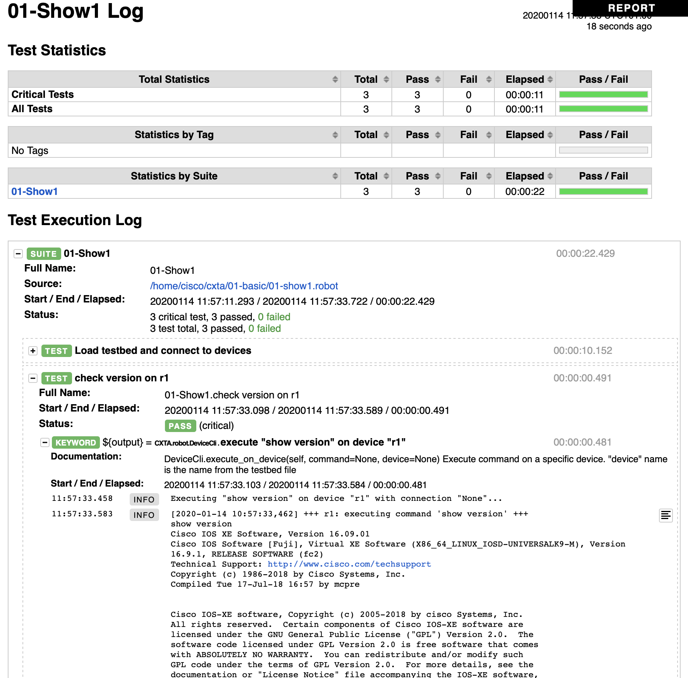

# Basic Tests

This Chapter introduces you to some basic Robotframework fundamentals and generic device interaction keywords.

## Test Execution Environment

The Robotframework and CXTA runtime environment is installed on a pre-built Container, which has been started in the [previous chapter](00-setup.md).  
The directory structure containing the scripts and tests has been mounted into the container (into /home/devnet/cxta), so you can create/edit and examine files on the Linux operating system on the host (in XXXX/DEVWKS-1407/CLEUR2020-CXTA), while the execution happens on the container.

Open an interactive session on the container using the following command:

```
docker exec -it cxta_devnet bash
```

You will end up in the _/home/devnet/cxta_ directory, and you can see all the files from the directory you started the environment from:

```
root@dafbe37b2f80:/home/devnet/cxta# ls -l
total 32
drwxr-xr-x  7 root root  224 Jan 24 09:40 01-basic
drwxr-xr-x  5 root root  160 Jan 24 09:40 02-parsing
drwxr-xr-x  3 root root   96 Jan 24 09:40 03-genie
-rw-r--r--  1 root root  397 Nov 25 10:46 Makefile
-rw-r--r--  1 root root  911 Nov 25 12:42 README.md
-rw-r--r--  1 root root 1470 Nov 25 10:46 Vagrantfile
-rw-r--r--  1 root root  694 Nov 25 12:40 docker-compose.yml
drwxr-xr-x 15 root root  480 Jan 23 22:00 docs
-rw-r--r--  1 root root  500 Jan 23 06:57 mkdocs.yml
-rwxr-xr-x  1 root root 2887 Jan 14 10:33 start-routers.sh
-rw-r--r--  1 root root  289 Nov 25 10:46 test-vms.robot
-rw-r--r--  1 root root 1000 Jan 23 07:53 testbed.yaml
root@dafbe37b2f80:/home/devnet/cxta#
```

You notice a directory `01-basic`, which contains the first test scripts we want to examine and execute:

## Your First Test Case

Change to the 01-basic directory and examine the 01-show1.robot file contained therein.  
It is a simple test suite which connects to the two routers we have spun up, collects a command which shows the version running on them, and compares them with an expected value:

```
# cd 01-basic
# cat 01-show1.robot

*** Settings ***
Library       CXTA
Resource      cxta.robot

*** Variables ***
# Location of the auto-generated testbed.yaml file which contains device
# credentials. Rather than just using "../testbed.yaml", which assumes
# the execution directory is the current directory, we set it
# relative to the directory this .robot file is in (${CURDIR}), which allows
# us also to execute the test case from a different directory (for example from
# the parent directory using   robot 01-basic/)
${testbed}    ${CURDIR}/../testbed.yaml

*** Test Cases ***
Load testbed and connect to devices
    use testbed "${testbed}"
    connect to device "r1"
    connect to device "r2"

check version on r1
    ${output}=   execute "show version" on device "r1"
    Should Contain   ${output}    Cisco IOS XE Software, Version 16.09.01

check version on r2
    ${output}=   execute "show version" on device "r2"
    Should Contain   ${output}    Cisco IOS XE Software, Version 16.09.01
```

This file is a robotframework test file, and you notice different sections:

- The **Settings** section contains the libraries we want to load. For this lab, we are using the _CXTA_ library and a set of libraries which are defined in the resource file _cxta.robot_. This file is bundled with the cxta libraries on the container, you can examine it via `more /venv/lib/python3.6/site-packages/CXTA/robot/cxta.robot` if you're interested.

- The **Variables** section allows you define variables which you can use in other sections of the file. Here we only define the ${testbed} variable which contains the location of the testbed.yaml file which contains the access information to the devices we'll be interacting with.

- The final **Test Cases** section contains the actual test cases we are executing when running this file.  
Robot (by default) executes each of the test cases in the order specified. A test case succeeds if all the steps within a test case succeed.


## Run the Test Case

Let's run it, executing it via `robot 01-show1.robot` on the container:

```
root@14b56b5cc0ac:/home/devnet/cxta/01-basic# robot 01-show1.robot
==============================================================================
01-Test1
==============================================================================
Load testbed and connect to devices                                   | PASS |
------------------------------------------------------------------------------
check version on r1                                                   | PASS |
------------------------------------------------------------------------------
check version on r2                                                   | PASS |
------------------------------------------------------------------------------
01-Test1                                                              | PASS |
3 critical tests, 3 passed, 0 failed
3 tests total, 3 passed, 0 failed
==============================================================================
Output:  /home/devnet/cxta/01-basic/output.xml
Log:     /home/devnet/cxta/01-basic/log.html
Report:  /home/devnet/cxta/01-basic/report.html
root@14b56b5cc0ac:/home/devnet/cxta/01-basic#
```


## Examine Robot Logfiles

The console output from Robotframework is quite terse and doesn't provide much more information than pass/fail for each of the test cases executed.

For more detailed reporting, as well as for troubleshooting in case things go wrong, you need to revert to additional files created by Robot (CXTA creates some more diagnostic files which we are not going to cover here):

- `log.html` is the most important log created and collects each test step including the device output and other diagnostic information 
- `report.html` contains a high-level report which shows pass/fail of each test case
- `output.xml` contains essentially the same information as the former two files combined, however in structured XML format for automated post-processing

Please open the log.html created in the directory XXXX/DEVWKS-1407/CLEUR2020-CXTA/01-basic folder on the laptop using a browser and click through the steps by expanding the test case steps (see below screenshot)




## Test Failures

We suggest you repeat the test, but change the version value the ${output} is checked against in one of the "check version on rX" test cases, i.e.

```
[...]
check version on r1
    ${output}=   execute "show version" on device "r1"
    Should Contain   ${output}    Cisco IOS XE Software, Version 99999999
```

re-run the test (alternatively, run 01-show1-fail.robot which already has this change), and re-examine the log.html created to see how robot highlights the error(s).


## Test Suite Setup/Teardown

By default, Robot executes all tests within a test suite (the robot file above in our example). If the number of tests grows large, there might be situations where you only want to run a subset of cases. Robotframework supports this by limiting the test case execution by tags (not used here) or by name. Let's try this using the `-t` (or `--test`) command line argument.  
Let's now run a test only checking r1's version (as before, execute this command on the container):

```
# robot -t "check version on r1" 01-show1.robot
```

(you can also use wildcards, i.e. `robot -t "*r1" 01-show1.robot` would also work)

You see the test failing:

```
==============================================================================
01-Test1
==============================================================================
check version on r1                                                   | FAIL |
AttributeError: 'NoneType' object has no attribute 'devices'
------------------------------------------------------------------------------
01-Test1                                                              | FAIL |
1 critical test, 0 passed, 1 failed
1 test total, 0 passed, 1 failed
```

The error message is unfortunately not that obvious, but if you examine the full .robot file, the first test case ("Load testbed and connect to devices") is now skipped, which causes subsequent test cases which rely on the device connections to fail.

This highlights a problem with the chosen approach (which we introduced for educational purposes ;-) ) as test cases are dependent on each other, which is something we should avoid as much as possible.

To support test interdependency, Robotframework (like many other testing frameworks) support **Setup** and **Teardown** functions which can be executed before a test case starts (and after a test case finishes). These setup functions can also be specified at a test suite level, i.e. before the first test starts and after the last test finishes.

We prepared a test suite utilizing this functionality in file 01-show2.robot:

```
*** Settings ***
Library       CXTA
Resource      cxta.robot
Suite Setup   Load testbed and connect to devices

*** Variables ***
${testbed}    ${CURDIR}/../testbed.yaml

*** Test Cases ***
check version on r1
    ${output}=   execute "show version" on device "r1"
    Should Contain   ${output}    Cisco IOS XE Software, Version 16.09.01

check version on r2
    ${output}=   execute "show version" on device "r2"
    Should Contain   ${output}    Cisco IOS XE Software, Version 16.09.01

*** Keywords ***
Load testbed and connect to devices
    use testbed "${testbed}"
    connect to device "r1"
    connect to device "r2"
```

Comparing this to 01-show1.robot, you'll notice that the first test case (where we connect to the devices) has now moved into the Keywords section, this creating a new Robot keyword "Load testbed and connect to devices", which is now called as part of the **Suite Setup**, i.e. before the first test is executed.

With this change, we can now selectively run any test case:

```
# robot -t "check version on r1" 01-show2.robot

==============================================================================
01-Test2
==============================================================================
check version on r1                                                   | PASS |
------------------------------------------------------------------------------
01-Test2                                                              | PASS |
1 critical test, 1 passed, 0 failed
1 test total, 1 passed, 0 failed
[...]
```

The console output only shows the test case executed, it doesn't show the Setup step, you need to revert to the log.html in the browser: 


## What's next?

Now that you have made yourself familiar with the environment and basic robot commands, let's move on to a [more advanced use case](02-parsing.md) which shows you the power of some of the CXTA and pyATS keywords.
