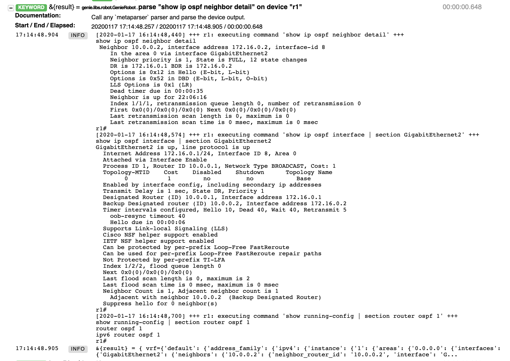
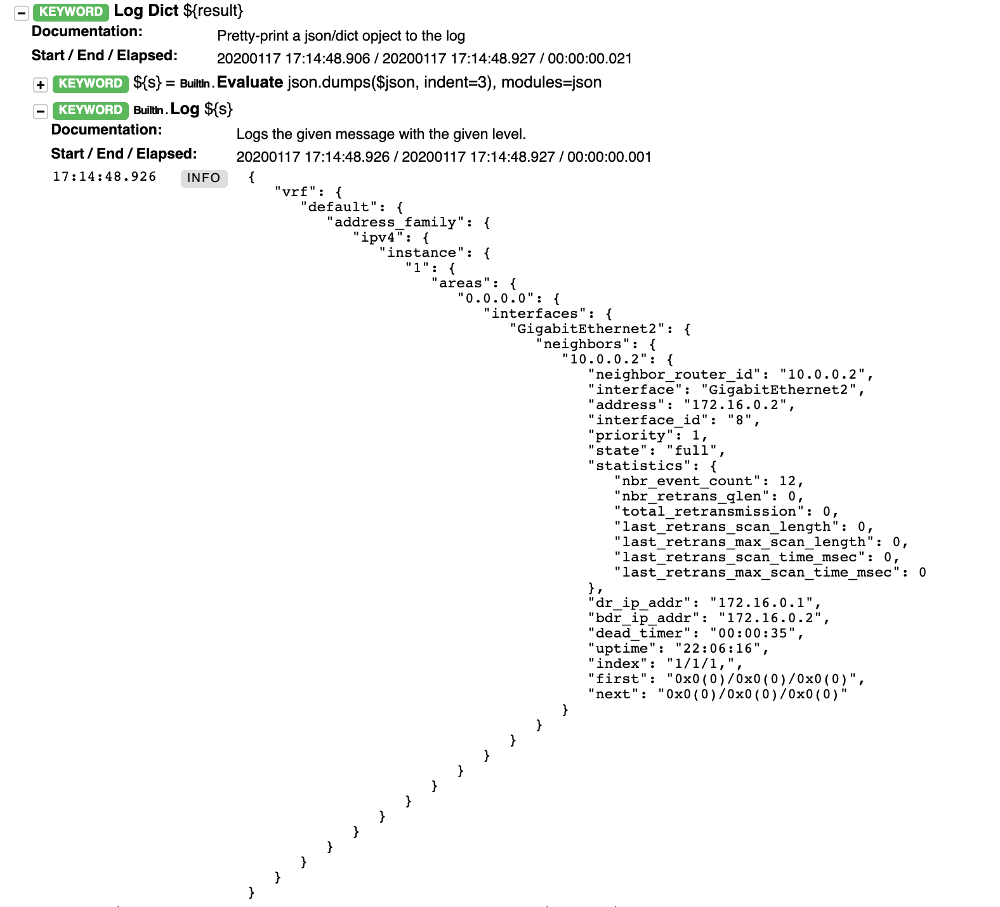
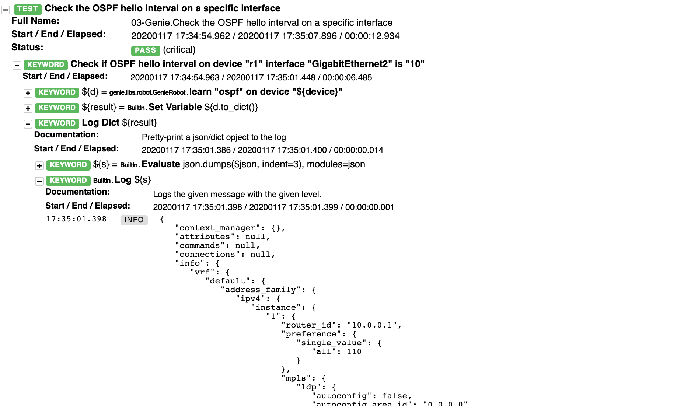

# Parsing with pyATS Genie

CXTA, a test automation library for Cisco's CX organization leverages the pyATS framework for much of its device keywords.  
pyATS is available on [DevNet](https://developer.cisco.com/pyats/) and is free to use. The libraries available also include Robotframework keywords, some of which we've already used (like `connect to device` or `use testbed`), and in this exercise we want to demonstrate [Genie](https://developer.cisco.com/docs/pyats), which deserves its own chapter.

Please change to the 03-genie directory and examine the 03-genie.robot test suite, which contains two test cases which we explain separately:

```
cd ../03-genie
more 03-genie.robot
```

## Parsing a Specific Command

First we want to perform a similar task as shown before: Parsing the OSPF neighbor information. This is what the first test case in the 03-parsing-genie.robot file does:

```
Get the ospf neighbor ID from R1 using Genie keywords (pyats)
    # runs a command through the genie parser, it returns a dictionary
    &{result}=  parse "show ip ospf neighbor detail" on device "r1"
    Log Dict   ${result}

    ${nbr_id}=  Get Value From Json   ${result}   $..neighbors.*.neighbor_router_id
    Should be Equal as Strings   ${nbr_id}[0]   10.0.0.2

    ${nbr_state}=  Get Value From Json   ${result}   $..neighbors.*.state
    Should be Equal as Strings   ${nbr_state}[0]   full
```

Please run the test (either run the whole file, or just run this one using `robot -t "Get the ospf*" 03-genie.robot`) and open the resulting log.html in your browser.

Please first expand on the _parse "show ip ospf neighbor detail" on device "r1"_ keyword.  
You'll notice that the Genie library uses multiple commands on the device to collect the required information. The inner workings of how this is achieved is fully transparent, a big time saver when dealing with (network) devices:



As in the TextFSM examples earlier, the result is returned as a dictionary, and line 4 dumps the contents into log.html:



The data is structured according to Genie datamodels, which are common across device types and OS (IOS-XE, IOS-XR, etc.).

Lines 6 and 9 now extract specific values from this dictionary and compare it with their expected values.

** _TODO: Ava to elaborate on the filter constructs in #6 and #9_ **


## Learning a Feature

Genie also offers a very powerful mechanism to gather all sorts of information about a specific feature configured and running on a device.  
Let's use this approach now to verify the hello interval present on the routers, checking each of the two routers individually.

Please examine the 2nd test case in 03-genie.robot:

```
Check the OSPF hello interval on a specific interface
    # we now use a keyword specified in the keyword section of this robot file below
    # in the keyword the user can specify the device name and the interface, so the
    # very same check can be reused
    Check if OSPF hello interval on device "r1" interface "GigabitEthernet2" is "10"
    Check if OSPF hello interval on device "r2" interface "GigabitEthernet2" is "10"

*** Keywords ***
Check if OSPF hello interval on device "${device}" interface "${interface}" is "${interval}"
    # uses a pyats keyword to learn operational information on ospf
    # the keyword runs various ospf commands as per the platforms model in genie
    ${d}=  learn "ospf" on device "${device}"
    # the learn keyword returns a python object, convert this into a dict
    ${result}=   Set Variable   ${d.to_dict()}
    Log Dict   ${result}
    ${v}=  Get Value From Json   ${result}   $..interfaces.${interface}.hello_interval
    Should be equal as numbers   ${v[0]}  ${interval}
```

Instead of repeating things twice for r1 and r2, we introduce a keyword (line 9) with parameters, and call this keyword for each router (5+6).

Within the keyword, we call the `learn "ospf" on device "${device}"` keyword, convert the result to a dictionary, and again use a Json filter construct to retrieve the value we're interested in. Please note the use of the parameters defined in the keyword (${device}, ${interface} and ${interval}).

Please run the test case (`robot 03-genie.robot`), examine the log.html and take a special look at the `Log Dict` output which contains the full information returned by `learn "ospf"..` (also [here](03-learn-ospf.txt)).  
We hope you'll be amazed by the wealth of information available at your fingertips.



## Conclusion

We hope you have enjoyed these exercises. Please visit us to discuss how Cisco CX can help you in your test automation journey!
